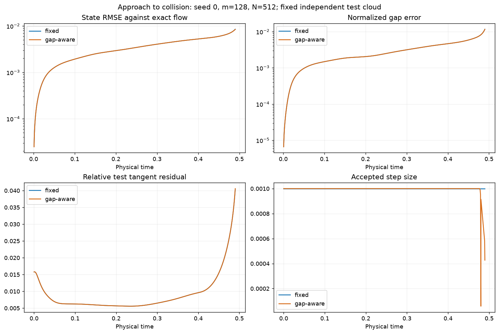
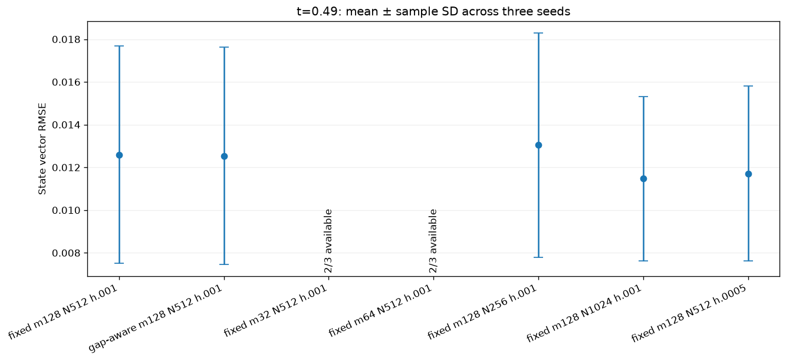
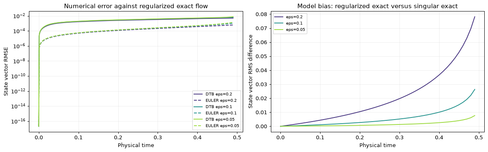

# Singular-game validation results

Executed on 2026-09-07 using Python 3.11, PyTorch 2.12.1, CPU, and float64. The complete short notebook ran successfully, including all seven plotted figures. All 11 acceptance tests passed. The full comparison executed 21 unregularized DTB runs and nine regularized DTB runs, plus the associated exact references and Euler baselines. Two low-dimension unregularized runs stopped or failed as recorded below.

The companion [notebook](../singular_game_2d_parameter_evolving_dtb.ipynb) keeps its short default configuration. Set `RUN_FULL_STUDY=True` to reproduce these larger comparisons. Values below are measured results, not target accuracies.

## Default correctness experiment

| Method | Time | State vector RMSE | Relative gap error | Invariant RMSE |
|---|---:|---:|---:|---:|
| DTB fixed (fixed schedule) | 0.45 | 0.0059796 | 0.0058745 | 0.0058729 |
| Direct Euler (fixed schedule) | 0.45 | 0.00081837 | 0.00084284 | 2.5159e-15 |

Fixed and gap-aware runs coincide at 0.45 because the gap cap is inactive. Direct Euler preserves the linear invariant to rounding accuracy. DTB uses a general two-output map and does not impose the invariant as an architectural constraint.

## Approach to collision: three seeds

| Scenario | Time | Seeds reaching time | State RMSE | Relative gap error |
|---|---:|---:|---:|---:|
| fixed m128 N512 h.001 | 0.45 | 3/3 | 0.007907 ± 0.00304 | 0.007809 ± 0.00219 |
| fixed m128 N512 h.001 | 0.48 | 3/3 | 0.01063 ± 0.00441 | 0.01453 ± 0.00588 |
| fixed m128 N512 h.001 | 0.49 | 3/3 | 0.01259 ± 0.00509 | 0.02189 ± 0.00918 |
| gap-aware m128 N512 h.001 | 0.45 | 3/3 | 0.007907 ± 0.00304 | 0.007809 ± 0.00219 |
| gap-aware m128 N512 h.001 | 0.48 | 3/3 | 0.01063 ± 0.00441 | 0.01453 ± 0.00587 |
| gap-aware m128 N512 h.001 | 0.49 | 3/3 | 0.01254 ± 0.00509 | 0.02187 ± 0.00923 |

Each entry is mean ± sample standard deviation (`ddof=1`) over seeds 0, 1, 2. Network initialization, the selected basis, and the training cloud vary with seed. The independent 2048-particle test cloud is fixed across every run.

The gap-aware controller activates late. In this configuration it changes final state error only slightly; the difference is small compared with the seed spread. This experiment does not establish that adaptive stepping improves accuracy generally.

## Dimension, sample count, and time-step study at t=0.49

| Scenario | Time | Seeds reaching time | State RMSE | Relative gap error |
|---|---:|---:|---:|---:|
| fixed m128 N512 h.001 | 0.49 | 3/3 | 0.01259 ± 0.00509 | 0.02189 ± 0.00918 |
| gap-aware m128 N512 h.001 | 0.49 | 3/3 | 0.01254 ± 0.00509 | 0.02187 ± 0.00923 |
| fixed m32 N512 h.001 | 0.49 | 2/3 | Unavailable | Unavailable |
| fixed m64 N512 h.001 | 0.49 | 2/3 | Unavailable | Unavailable |
| fixed m128 N256 h.001 | 0.49 | 3/3 | 0.01304 ± 0.00525 | 0.02215 ± 0.0089 |
| fixed m128 N1024 h.001 | 0.49 | 3/3 | 0.01147 ± 0.00384 | 0.01882 ± 0.00641 |
| fixed m128 N512 h.0005 | 0.49 | 3/3 | 0.01171 ± 0.00409 | 0.02019 ± 0.00816 |

The study varies one control at a time. The smaller fixed step modestly reduces DTB state error here; this alone does not separate time, tangent, and map-family effects. Projection residuals and local nonlinear map defects are separate diagnostics, not additive parts of an exact error decomposition.

### Explicit stopping and failures

- `fixed m32 N512 h.001`, seed 1: **stopped** at last valid time 0.437; minimum monitored gap below r_stop=0.02.
- `fixed m64 N512 h.001`, seed 1: **failed** at last valid time 0.487; proposed test state reaches or crosses x1=x2 (leaves the positive-gap branch) (rejected proposal time 0.488).

A horizon with fewer than three available seeds has no aggregate accuracy estimate. In particular, the failed/stopped trials are not silently omitted from an apparently complete three-seed comparison. All stored trajectory states have positive gaps and finite coordinates; rejected proposals are not accepted as trajectory states.

## Direct-Euler refinement near the singularity

| Step size | Time | State vector RMSE | Relative gap error |
|---:|---:|---:|---:|
| 0.001 | 0.45 | 0.00081837 | 0.00084284 |
| 0.001 | 0.48 | 0.0012637 | 0.0019133 |
| 0.001 | 0.49 | 0.0016212 | 0.0032705 |
| 0.0005 | 0.45 | 0.00041022 | 0.00042274 |
| 0.0005 | 0.48 | 0.00063541 | 0.00096392 |
| 0.0005 | 0.49 | 0.00081894 | 0.0016596 |

Halving the Euler step decreases its error against the exact flow at all three horizons. The numerical values use the same initial test cloud as DTB.

## Regularized companion systems

| Scenario | Time | Seeds reaching time | State RMSE | Relative gap error |
|---|---:|---:|---:|---:|
| epsilon=0.2 | 0.49 | 3/3 | 0.006122 ± 0.00254 | 0.006143 ± 0.00225 |
| epsilon=0.1 | 0.49 | 3/3 | 0.009001 ± 0.0037 | 0.01155 ± 0.00441 |
| epsilon=0.05 | 0.49 | 3/3 | 0.01119 ± 0.00463 | 0.01721 ± 0.00734 |

These errors are measured against the corresponding regularized exact flow, computed by bracketed log-gap bisection. They are not errors against the singular system. The notebook separately plots the model bias introduced by regularization. The curves below use seed 0; the table above includes all three seeds.

## Files and reproducibility

- `default_summary.csv`: method errors and measured runtimes at 0.45.
- `default_*_metrics.csv`: every recorded default physical-time diagnostic.
- `study_runs.csv`: individual seeds, requested horizons, availability, and stop reasons.
- `study_summary.csv`: three-seed means and sample standard deviations.
- `regularized_runs.csv`, `regularized_summary.csv`: companion results.
- `euler_refinement.csv`: exact-reference Euler step-size comparison.
- `approach_*_metrics.csv`, `approach_*_steps.csv`: seed-0 diagnostics through 0.49.
- `flow_approach_fixed.png`, `flow_approach_gap-aware.png`: matched exact/DTB/Euler snapshots through 0.49.
- `environment.json`: versions and configurations; `source_hashes.json`: source fingerprints.

Runtimes include per-step diagnostics and CPU overhead; they are not kernel-only performance benchmarks. This was local Python execution of all code cells with captured display outputs; an actual hosted Colab session was not launched. The required shared modules match the locally available remote-tracking revision.
