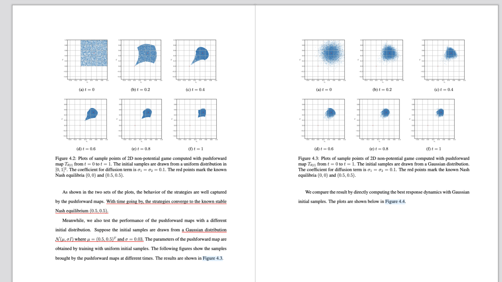
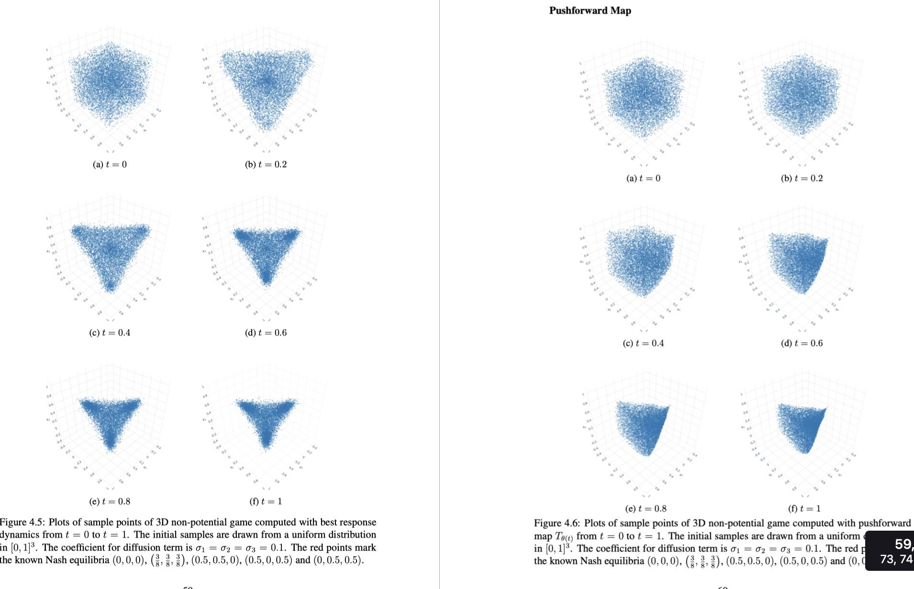
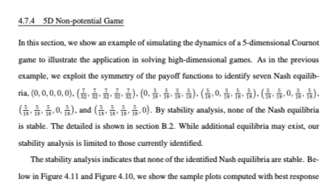

# Neural–DTB Replication of 2D, 3D, and 5D Non-Potential Games

This self-contained folder implements the supplied unnormalized Neural–DTB
algorithm and uses it to reproduce the qualitative behavior of target Figures
4.2 and 4.3: strategy samples contract toward the stable Nash equilibrium
`(0.5,0.5)` from uniform and Gaussian initial distributions.

The supplied mathematical source and target screenshot are kept beside the
code in [`references/`](references/README.md):



The same engine also computes the supplied three-player Figures 4.5 and 4.6:



It now includes the supplied five-player Section 4.7.4 case and a controlled
`N=2000` comparison of depth-2 and depth-4 tangent networks:



No original Deep Tangent Bundle file is modified. The project reuses the
original flat-parameter/restricted-Jacobian pattern, truncated-SVD approach,
and Cournot drift in a separate package.

## Target experiment

The original repository's Cournot drift is

```text
dx1/dt = -2 b x1 + 2 b mu x2 - 2 b mu x2^2
dx2/dt = -2 b x2 + 2 b mu x1 - 2 b mu x1^2
```

with `b=1` and `mu=2`. Its equilibria are `(0,0)` and `(0.5,0.5)`; the second
is stable.

| Quantity | Replication value |
|---|---|
| Time interval | `0 <= t <= 1` |
| Snapshot times | `0, 0.2, 0.4, 0.6, 0.8, 1.0` |
| Figure 4.2 initial law | Uniform on `[0,1]^2` |
| Figure 4.3 initial law | `N((0.5,0.5), 0.03 I)` |
| Noise amplitude | `sigma_1=sigma_2=0.1` |
| Algorithm diffusion matrix | `D=diag(sigma_i^2)=0.01 I` |

The last line follows the SDE/Fokker–Planck convention
`dX=b(X)dt+sigma dW`. Use `--diffusion-entry 0.1` if the underlying source
instead defines the caption's `0.1` as an entry of `D` itself.

### Three-player game

Let `r_i` be the sum of the other two players' strategies. The implemented
three-player payoff and drift are

```text
Pi_i(x) = -d - b x_i^2 + 2 b mu x_i r_i (1-r_i)
b_i(x) = -2 b x_i + 2 b mu r_i - 2 b mu r_i^2,
b=1, mu=2.
```

This uses the equilibrium-consistent interpretation that the two aggregate
terms in the printed cost contain the opponents' total `r_i`, not the total
`S=sum_j x_j`. Reading the printed `S` literally produces a different gradient
that does not vanish at the four reported nonzero equilibria; the complete
algebra and supplied close-ups are recorded in [`references/`](references/README.md).

Its five listed equilibria are the origin, `(3/8,3/8,3/8)`, and the three
permutations of `(1/2,1/2,0)`. The 3D target uses uniform samples on `[0,1]^3`,
noise amplitudes `sigma_1=sigma_2=sigma_3=0.1`, and the same six times.
Snapshot legends show the unstable origin as a gold `X` and the four stable
equilibria as red circles.

### Five-player game

The five-player source lists seven known equilibria:

```text
(0,0,0,0,0)
(7/32,7/32,7/32,7/32,7/32)
the five permutations of (0,5/18,5/18,5/18,5/18).
```

All seven are reported unstable. The one-zero equilibria are boundary Nash
points for nonnegative quantities: when the unconstrained best response is
negative, it is projected to zero. The five-player drift is therefore
`2b*(max(mu*r_i*(1-r_i),0)-x_i)`. This projection is necessary for the source's
five one-zero points to be equilibria.

## Fastest replication

Create an environment and install dependencies:

```bash
python3 -m venv .venv
source .venv/bin/activate
python -m pip install -r requirements.txt
```

Run the mathematical tests:

```bash
python -m pytest
```

Run both target experiments with Colab-friendly settings:

```bash
python replicate_thesis_figures.py --device auto
```

Run the three-player case:

```bash
python replicate_three_player_game.py --device auto
```

Run the confirmed `N=2000`, depth-4 configuration with labeled stability:

```bash
python replicate_three_player_game.py \
  --particles 2000 \
  --depth 4 \
  --svd-rtol 1e-3 \
  --skip-sde-baseline \
  --device auto \
  --output-dir outputs/three_player_n2000_depth4
```

Here `depth=4` means four hidden `Linear+tanh` blocks plus the final linear
output layer. The saved result is available under
[`verified_results/three_player_n2000_depth4/`](verified_results/three_player_n2000_depth4/README.md).

Run the two matched five-player settings:

```bash
python replicate_five_player_game.py --particles 2000 --depth 2 --svd-rtol 1e-3 --output-dir outputs/five_player_depth_comparison/depth2
python replicate_five_player_game.py --particles 2000 --depth 4 --svd-rtol 1e-3 --skip-sde-baseline --output-dir outputs/five_player_depth_comparison/depth4
python compare_five_player_depths.py
```

Both use seed 0, width 32, `m=128`, `h=0.005`, 200 steps, and uniform initial
samples on `[0,1]^5`. The completed comparison is included under
[`verified_results/five_player_depth_comparison/`](verified_results/five_player_depth_comparison/README.md).

Run the controlled 500-sample MLP/MMNN pilot:

```bash
python compare_three_player_architectures.py \
  --particles 500 --width 32 --rank 8 --depth 2 \
  --basis-size 128 --svd-rtol 1e-3 --device auto
```

The MMNN uses blocks `A*tanh(W*x+b)+c`: `W,b` are frozen and excluded from the
tangent pool, while `A,c` are tangent-eligible. Both architectures select the
same `m=128` scalar tangent directions and start from identical particles. The
verified single-seed result is under
[`verified_results/three_player_mlp_mmnn_n500/`](verified_results/three_player_mlp_mmnn_n500/README.md).

Run the simplest MLP/Neural-ODE tangent-basis comparison:

```bash
python compare_two_player_mlp_node.py \
  --particles 1000 --width 16 --depth 2 \
  --basis-size 64 --node-inner-steps 4 --device auto
```

This uses only the two-player game and uniform samples on `[0,1]^2`. Both
basis generators have 354 parameters and remain fixed during DTB evolution.
The NODE integrates its internal vector field with four fixed RK4 steps; the
parameter sensitivities of its terminal flow form the tangent dictionary. The
completed comparison is under
[`verified_results/two_player_mlp_node_n1000/`](verified_results/two_player_mlp_node_n1000/README.md).

A completed 256-particle result is included under
[`verified_results/three_player_n256/`](verified_results/README.md) so the 3D
panels and raw arrays can be inspected without rerunning Colab.

Compare the requested larger sample counts with a shared numerical setup:

```bash
python replicate_three_player_game.py --particles 512  --svd-rtol 1e-3 --skip-sde-baseline --output-dir outputs/sample_study_stable/n512
python replicate_three_player_game.py --particles 1024 --svd-rtol 1e-3 --skip-sde-baseline --output-dir outputs/sample_study_stable/n1024
python replicate_three_player_game.py --particles 5000 --svd-rtol 1e-3 --skip-sde-baseline --output-dir outputs/sample_study_stable/n5000
python compare_sample_counts.py
```

The comparison figure, metrics, individual panels, and raw histories are also
included in [`verified_results/sample_count_study/`](verified_results/sample_count_study/README.md).

This creates:

```text
outputs/thesis_replication/
  figure_4_2_uniform/
    dtb_snapshots.png
    sde_baseline_snapshots.png
    diagnostics.png
    history.npz
    config.json
  figure_4_3_gaussian/
    dtb_snapshots.png
    sde_baseline_snapshots.png
    diagnostics.png
    history.npz
    config.json
```

The gold `X` marks the unstable origin and the red circle marks the stable
equilibrium `(0.5,0.5)`.

## Denser experiment

After the fast run succeeds, use the larger tangent dictionary and point cloud:

```bash
python replicate_thesis_figures.py --paper-scale --device auto
```

The paper-scale preset uses `N=5000`, `m=256`, `h=0.01`, and 100 steps. The
exact network width, particle count, tangent basis, Euler step, and SVD cutoff
are not visible in the supplied screenshot, so these values are documented
replication choices rather than claimed source parameters. Override the point
count with `--particles` when needed.

For the numerically stiffer 3D score transport, the validated preset uses
`h=0.005`, 200 steps, `m=128`, and `svd_rtol=1e-4`:

```bash
python replicate_three_player_game.py --paper-scale --device auto
```

Large empirical systems are more sensitive to rare particle excursions. The
verified `N=512,1024,5000` comparison therefore uses `svd_rtol=1e-3` for every
sample count; changing the cutoff between runs would confound the comparison.

## Run one initialization only

Uniform Figure 4.2-style run:

```bash
python run_game_dynamics.py \
  --initial-distribution uniform \
  --run-sde-baseline \
  --output-dir outputs/uniform_only
```

Gaussian Figure 4.3-style run:

```bash
python run_game_dynamics.py \
  --initial-distribution gaussian \
  --initial-mean 0.5 \
  --initial-variance 0.03 \
  --run-sde-baseline \
  --output-dir outputs/gaussian_only
```

## Algorithm implemented

For particles `x_i^k`, log density `ell_i^k`, and score `q_i^k`, the target
velocity is

```text
v_i^k = b(x_i^k) - 0.5 D q_i^k.
```

The neural tangent field is projected by the raw stacked least-squares system:

```text
J_stack = (J_1; ...; J_N)       shape (N*d, m)
V_stack = (v_1; ...; v_N)       shape (N*d)
alpha   = V_r Sigma_r^-1 U_r^T V_stack
u(x)    = J_selected(x) alpha
```

No `1/N` or `1/sqrt(N)` factor is applied. Singular values are retained when
`sigma_j > svd_rtol * sigma_1`. The explicit Euler step transports particles,
log density, and score using exact automatic differentiation of `grad u`,
`div u`, and `grad(div u)`.

### Periodic tangent-network refit

The game solver now includes the block reset used by the original Deep
Tangent Bundle method. Within a block it keeps the linearization point and
selected tangent coordinates fixed and accumulates `sum(alpha_k)`. At a block
boundary it constructs, on the current particle cloud,

```text
teacher(x) = f_theta_base(x) + h J_theta_base,S(x) sum(alpha_k),
```

fits the trainable network parameters to that teacher with Adam, and starts a
new tangent block around the fitted parameters. The optimizer changes only the
tangent network; it does not overwrite particles, log density, or score.
Frozen MMNN `W,b` parameters remain frozen.

Enable a refit every 20 physical steps with:

```bash
python run_game_dynamics.py \
  --refit-interval 20 \
  --refit-optimizer-steps 100 \
  --refit-learning-rate 1e-3 \
  --refit-batch-size 512 \
  --output-dir outputs/periodic_refit
```

`--refit-interval 0` disables periodic refitting. Optionally add
`--refit-residual-threshold 0.4` to trigger an earlier reset when the relative
projection residual exceeds `0.4`. Each run saves `refit_diagnostics.png` and
the event mask, before/after fit RMSE, event reason, block age, target norm,
and absolute projection error in `history.npz`.

This is the Eulerian game-dynamics analogue of the original method's
pushforward-map refit: the fit data are current spatial particles rather than
fixed PDE reference coordinates. The distinction is recorded in every
`config.json`.

## Algorithm-to-code map

| Algorithm block | Code |
|---|---|
| Initialization | `game_dtb/state.py` and Block 1 in `runner.py` |
| MLP and frozen-feature MMNN models | `game_dtb/models.py` |
| Select tangent coordinates | Block 2 in `algorithm.py` |
| Game plus score velocity | Block 3 in `algorithm.py` |
| Restricted Jacobians | `projection.selected_parameter_jacobian` |
| Unnormalized stack | `projection.stack_unnormalized_system` |
| Truncated SVD | `projection.truncated_svd_solve` |
| Spatial score terms | `derivatives.tangent_velocity_and_spatial_terms` |
| Euler transport | Block 9 in `algorithm.py` |
| Six-panel 2D/3D/5D projections | `runner._plot_snapshots` |
| Five-dimensional pairwise view | `runner._plot_pairwise_final` |
| Direct SDE comparison | `runner.simulate_euler_maruyama` |

## Folder layout

```text
references/                    supplied TeX algorithm, target images, notes
verified_results/              checked 3D/5D results, raw arrays, configuration
game_dtb/                      reusable Neural–DTB implementation
tests/                         twenty mathematical/integration tests
examples/custom_game.py        instructional custom game
run_game_dynamics.py           configurable single experiment
replicate_thesis_figures.py    one-command Figures 4.2/4.3 workflow
replicate_three_player_game.py one-command Figures 4.5/4.6 workflow
replicate_five_player_game.py  one-command Section 4.7.4 workflow
compare_five_player_depths.py  matched depth-2/depth-4 comparison
compare_three_player_architectures.py  500-sample MLP/MMNN pilot
compare_two_player_mlp_node.py         1000-sample MLP/NODE pilot
COLAB_TUTORIAL.md               GitHub-to-Colab instructions
notebooks/                      executable Colab notebook
SUMMARY.md                      technical assumptions and validation
```

## Reading the output

`history.npz` contains the six DTB particle snapshots, optional SDE baseline,
final score and log density, projection residuals, retained SVD ranks, and
coefficient norms. A low projection residual is necessary but not sufficient
for a scientifically accurate result; also compare the DTB point clouds with
the direct SDE baseline and run refinement studies.

## Important limitations

- Uniform density has zero score only in the box interior and a nonsmooth
  boundary. The implementation uses the interior score for sampled points.
- The scheme is explicit Euler and has no adaptive time step.
- The 3D problem is numerically stiffer; the rejected `h=0.02` trial diverged
  near `t=1`, so the published preset uses `h=0.005`.
- A 5D distribution cannot be shown in one ordinary scatter plot. The six
  panels use `x1` against the mean of `x2,...,x5`, and `pairwise_final.png`
  supplies all ten coordinate-pair projections. Some equilibrium markers
  overlap in the summary projection.
- Because all seven reported 5D equilibria are unstable, distance to them is a
  diagnostic rather than a convergence target.
- The source screenshot does not expose every training/numerical parameter.
- The neural parameters stay fixed because the supplied algorithm does not
  prescribe the original Allen–Cahn periodic reset/refit rule.
- Strong conclusions require step-size, particle-count, tangent-basis, and SVD
  tolerance refinement.
- The MLP/MMNN comparison is one seed and one MMNN rank. It demonstrates the
  code path but is not a general architecture ranking.

See [COLAB_TUTORIAL.md](COLAB_TUTORIAL.md) for the GitHub workflow.
